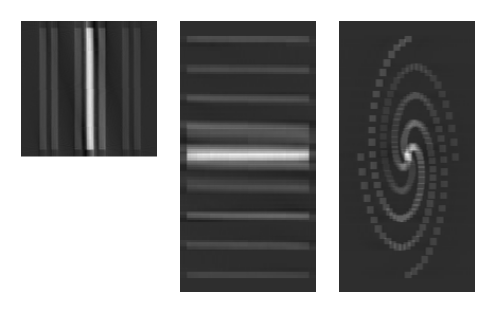

## Задача генерации эталонных входных данных для алгоритма автоматической вертикальной сшивки изображений КТ


### Постановка задачи:
Когда исследуемый объект имеет габариты превышающие область сканирования томографа, возникает необходимость сканирования объекта по частям и последующей сшивки отдельных реконструкций, с помощью специального алгоритма автоматической вертикальной сшивки изображений КТ. Задача состоит в генерации входных данных для этого алгоритма путем имитации процесса стекового сканирования. Эти данные представляют собой набор вертикально смежных реконструкций частей объекта и могут быть как идеальными, так и с различными искажениями для имитации реконструкций, максимально приближенных к реальным.
Текущая версия позволяет генерировать набор реконструкций с произвольным разбиением и искажениями смещения оси и зашумления.


### Зависимости:
- [TomoPhantom](https://github.com/dkazanc/TomoPhantom)
- [ToMoBAR](https://github.com/dkazanc/ToMoBAR)
- [OpenCV](https://opencv.org/)

### Сборка:
```
cd stacked-tomoscan-gen
mkdir build
cd build
cmake ..
make
```

### Использование:
```
./strg <config_file>
```
Построение демонстрационных реконструкций:
```
./strg ../demos/cilynder.config
./strg ../demos/shepp-logan.config
```
Параметры генерации задаются в конфигурационном файле специального формата (см. примеры в папке [demos](demos)). Файл должен содержать следующие параметры:
| **Имя**                      | **Описание**                                                   | **Значение** |
|------------------------------|----------------------------------------------------------------|--------------|
| **_Параметры модели_**       |                                                                |              |
| models_lib                   | Адрес библиотеки 3D фантомов                                   | str          |
| model                        | Номер модели в библиотеке                                      | uint         |
| **_Параметры разбиения_**    |                                                                |              |
| height                       | Высота цельной реконструкции всей модели                       | uint         |
| width                        | Ширина реконструкции                                           | uint         |
| parts_num                    | Количество реконструкций                                       | uint         |
| overlay                      | Толщина перекрытия соседних реконструкций                      | uint         |
| **_Параметры сканирования_** |                                                                |              |
| angles_num                   | Количество углов с которых регистрируются проекции             | uint         |
| angles_step                  | Шаг между углами                                               | float        |
| **_Параметры искажений_**    |                                                                |              |
| seed                         | Сид для псевдослучайных искажений                              | uint         |
| is_noisy                     | Нужно ли накладывать шум                                       | bool         |
| noise_amplitude              | Интенсивность шума                                             | uint         |
| is_offset                    | Нужно ли делать случайные смещения относительно оси            | bool         |
| max_offset                   | Максимальное смещение относительно оси                         | uint         |
| is_tilted                    | Нужно ли делать случайные наклоны относительно оси             | bool         |
| max_tilt                     | Максимальный наклон относительно оси                           | uint         |
| **_Параметры изображений_**  |                                                                |              |
| save_path                    | Адрес сохранения реконструкций                                 | str          |
| format                       | Формат изображений {.tiff,.png,...}                            | str          |
| type                         | Формат пикселей {uint8,uint16,uint32,int8,int16,int32,float32} | str          |

### Демонстрационные модели
| Модель                      | Изображение                                          |
|-----------------------------|------------------------------------------------------|
| 1. "Цилиндр"                |             |
| 2. "Пористый эллипсоид"     |                |
| 3. "Неоднородный эллипсоид" |           |
| 4. "Цилиндр из шаров"       |  |
| 5. "Волокна"                |               |
| 6. "Шепп-Логан"             |          |
| 7. "Столбцы"                |              |
| 8. "Горизонтальные спирали" |   |
| 9. "Вертикальные спирали"   |     |
| 10. "Шипы"                  |               |

### Ссылки:
- Документация: https://egor79k.github.io/stacked-tomoscan-gen/html/index.html
- Отчет: https://github.com/egor79k/stacked-tomoscan-gen/blob/main/docs/report.pdf
